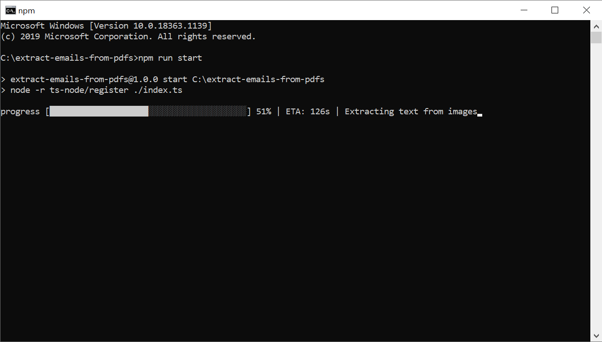

# extract-emails-from-pdfs
Extract all email addresses from a folder containing pdfs (scanned or searchable) and output them to a txt file



# How to run
Install NodeJS

open a command prompt and navigate to the root of this project and run:
```
npm i
```

Copy your pdfs that you want to analyse to the pdfs folder.
The pdfs can be inside nested folders, the program will recursivly search for all .pdf files in the whole pdfs folder.

Wait for the packages to install and then run:
```
npm start
```

# Disclaimer

Only tested this with NodeJS v12

This will only work on Windows since the OCR engine that we use (Tesseract) only has binaries for Windows
